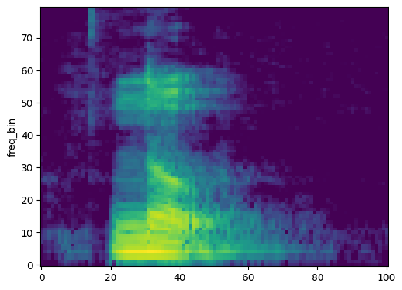
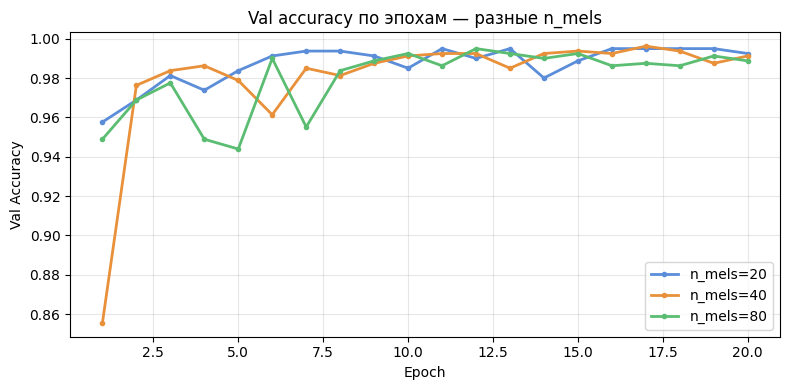
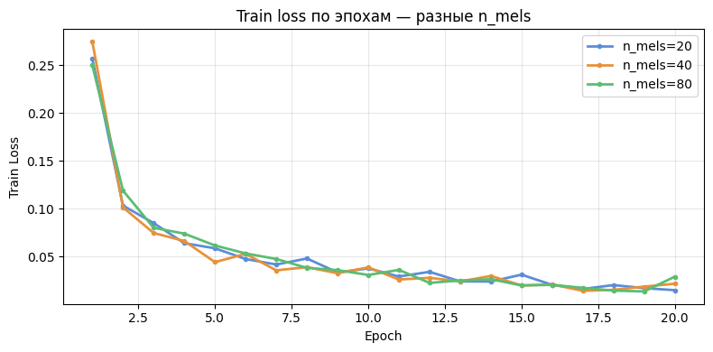
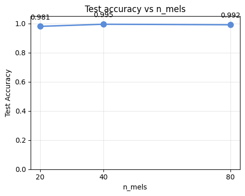
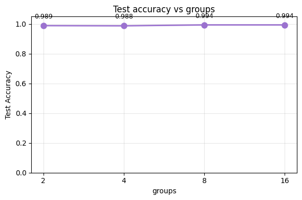
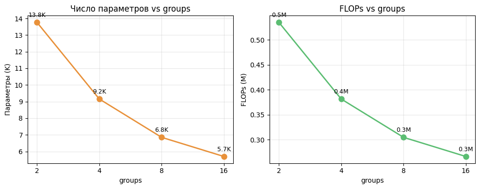
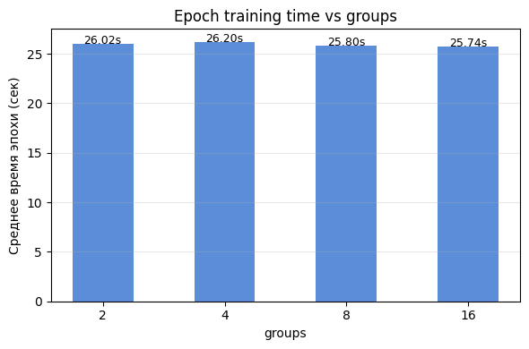

# Assignment 1. Digital Signal Processing

# Part 1 - LogMelFilterBanks
Для реализации собственного LogMel фильтрбанка нужно:
- Получить спектрограмму сигнала
```python
stft_output = self.spectrogram(x)
```
- Перевести синал в мощность
```python
power_spectrum = torch.abs(stft_output).pow(self.power)
```
- Перемножить melscale банки на мощность, чтобы получить перераспределенные частоты
```python
mel_spectrogram = torch.matmul(power_spectrum.transpose(-1, -2), self.mel_fbanks).transpose(-1, -2)
```
- Взять логарифм значений
```python
log_mel_spectrogram = torch.log(mel_spectrogram + 1e-6)
```

Далее сравним LogMelFilterBanks и torchaudio.transforms.MelSpectrogram, для этого загрузим датасет SPEECHCOMANDS (разз уж он все равно не нужен) и выберем любой элемент
```python
signal = train_yesno.__getitem__(100)[0][0]
```

И сравним графики спектрограмм
```python
melspec = torchaudio.transforms.MelSpectrogram(
    hop_length=160,
    n_mels=80
)(signal)


plot_spectrogram(melspec)
```


```python
logmelbanks = LogMelFilterBanks(hop_length=160,
    n_mels=80)(signal)

plot_spectrogram(melspec)
```



_Диаграммы идентичны_ (не только на глаз, на равенство тоже сравнил))
```python
torch.log(melspec + 1e-6).shape == logmelbanks.shape, torch.allclose(torch.log(melspec + 1e-6), logmelbanks)
```


Далее кода будет поменьше.

## Part 2
Далее план следующий: собрать и обучить CNN, с разными параметрами n_mels с параметром groups=1, потом выбрать лучший и на нем провести сравнение разных параметров groups (жадный алгоритм получается)
Соберем CNN, со следующими слоями:
- Свертка из n_mels -> 32
- Свертка 32 -> 64
- Свертка 64 -> 64  
После обучения получаем  
  
  
  

Умозрительно по графику accuracy я выбрал n_mels = 20, но потом понял, что 20 было лучше по loss.
Фиксируем n_mels=40 и тестируем разные параметр groups = [2, 4, 8, 16]   
После обучения на тех же данных получаем интересные результаты    
  
  
  


# Conclusion
Мне понравилось влияние n_groups на результат, accuracy выросло, время обучения не изменилось, количество вычислений упало, как и число параметров. Время обучения мне кажется не значимо, потому что я считал в коллабе и это может быть максимальное выремя, которое можно выжать. Но количество flops точно скажется на бОльших моделях. 